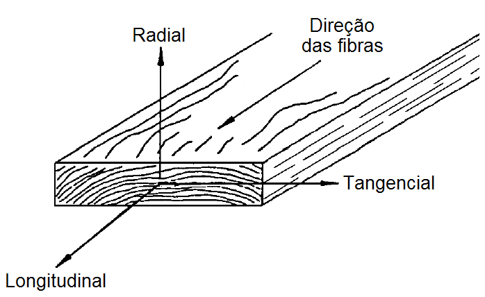
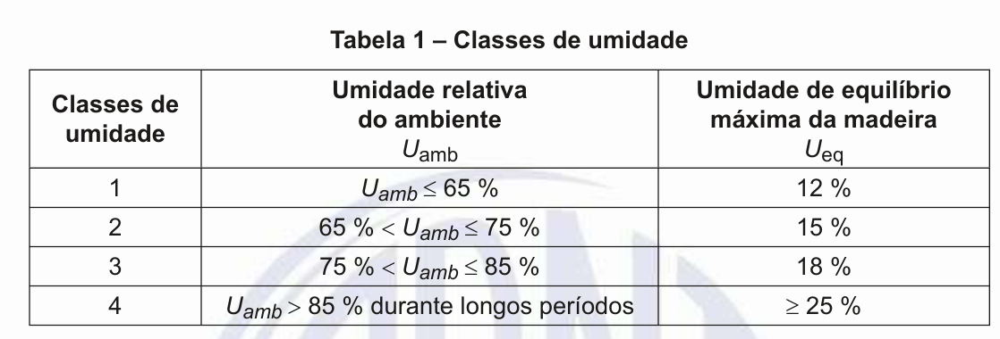
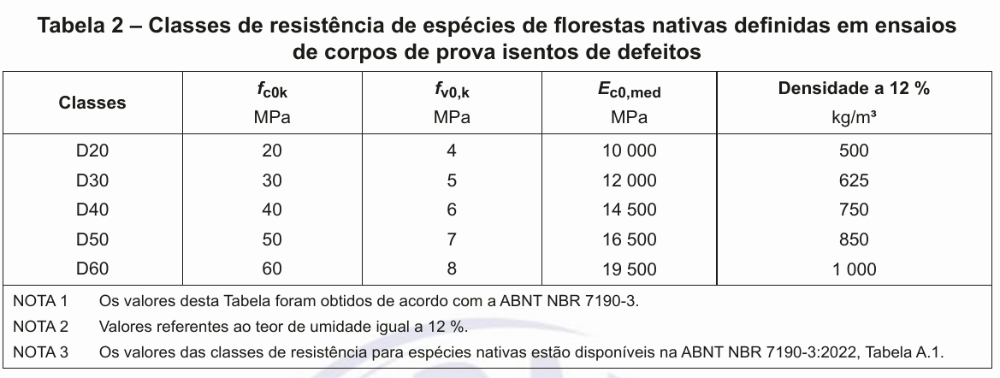
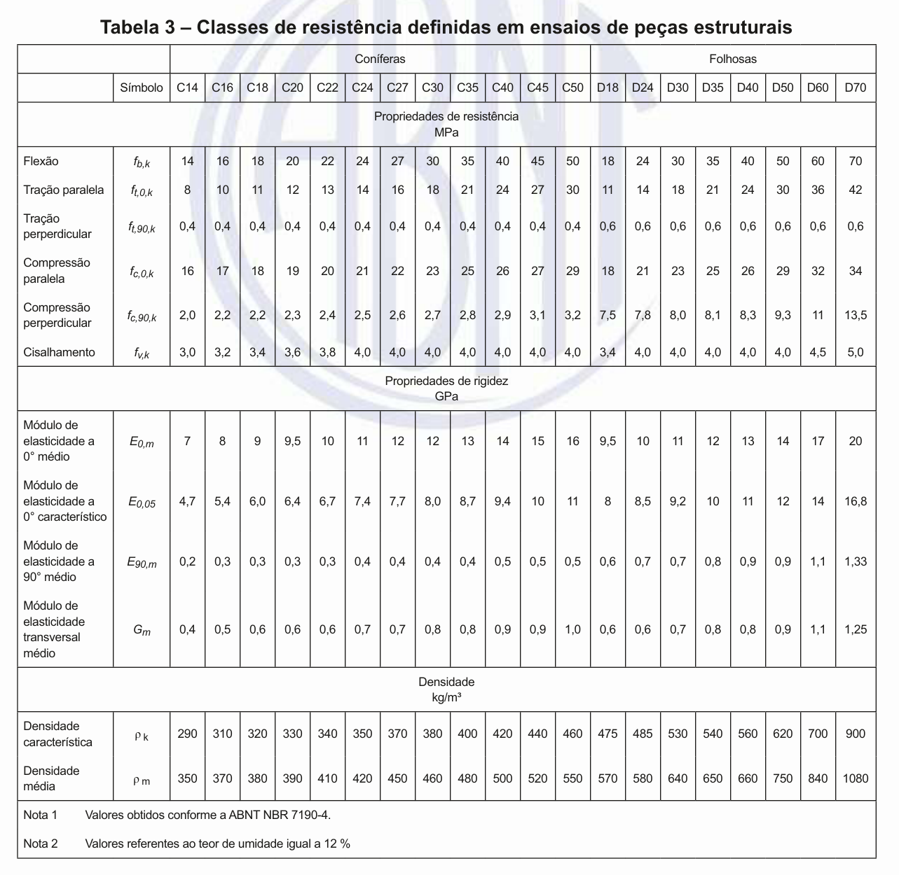
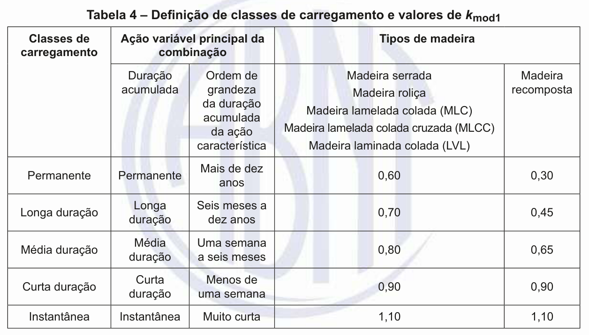
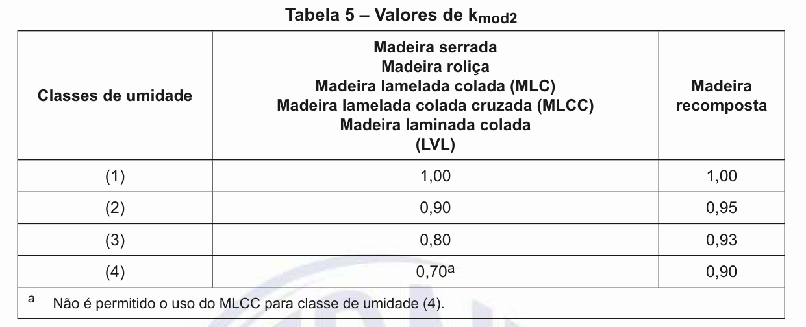

.. image:: madeira.png
   :align: right
   :alt: "Logotipo"
   
   
2 - Propriedades da Madeira
========================

2.1 - Anisotropia
---------------

Quando um corpo é fisicamente homogêneo, mas com propriedades que variam com a direção, longitudinal,radial e transversal, ele é formado por um material **anisotrópico**.
*Esse é o caso da madeira*.
Ou seja, **as propriedades da madeira variam com a direção**.

   
.. admonition:: NBR 7190-1:2023

   As propriedades da madeira são condicionadas por sua estrutura anatômica, devendo distinguir-se os valores correspondentes à tração dos correspondentes à compressão, bem como os valores correspondentes à direção paralela às fibras dos correspondentes à direção perpendicular às fibras.
   Devem também se distinguir os valores correspondentes às diferentes classes de umidade.   

2.2 - Densidade básica e densidade aparente
--------------------------------------

A **densidade básica** da madeira é a massa específica convencional obtida pelo quociente da massa
seca pelo volume saturado.

A **densidade aparente** da madeira é a massa específica obtida pelo quociente da massa pelo volume,
ambos à mesma umidade

2.3 - Resistência
------------------

A resistência é a aptidão de um matérial suportar tensões.

2.4 - Rigidez
--------------

A rigidez dos materiais é medida pelo valor médio do módulo de elasticidade, determinado na fase
de comportamento elástico-linear.

2.5 - Umidade
--------------

.. admonition:: NBR 7190-1:2023

    O projeto das estruturas de madeira deve ser feito admitindo-se uma das classes de umidade especificadas na Tabela 1. 
    As classes de umidade têm por finalidade ajustar as propriedades de resistência e de rigidez da madeira em função das condições ambientais onde permanecem as estruturas durante a sua vida útil.

Classes de  umidade
+++++++++++++++++++++++++++++++

O projeto das estruturas de madeira deve ser feito admitindo-se uma das classes de umidade especificadas na Tabela 1. 

As classes de umidade têm por finalidade ajustar as propriedades de resistência e de rigidez da madeira em função das condições ambientais onde permanecem asestruturas durante a sua vida útil.

   
A condição **padrão de referência de umidade** tomada pela ABNT NBR 7190-1:2023 é definida pelo teor de umidade de equilíbrio da madeira de 12 %.
Todos os valores fornecidos são, então, referidos a essa umidade.

2.6 - Classes de resistência
-----------------------------

2.7 - Valores de cálculo(:math:`X_{d}`)
----------------------------------

.. math::

    X_{d} = k_{mod} \frac{X_{k}}{\gamma_{w}}
   

- :math:`X_{k}` é valor característico;

- :math:`\gamma_{w}` é o coeficiente de minoração das propriedades da madeira;

    Para **estados-limite últimos** decorrentes de tensões normais tem o valor básico de 1,4 e para os decorrentes de tensões de cisalhamento tem o valor básico de 1,8.

    O coeficiente de ponderação para **estados-limite de serviço** tem o valor básico de 1,0.

- :math:`k_{mod}` é coeficiende de modificação.

    .. math::

        k_{mod} = k_{mod_{1}} \times k_{mod_{2}}
    
    

2.8 - Módulo de elasticidade(:math:`E`)
----------------------------------

O módulo de elasticidade na direção paralela às fibras (:math:`E_{0}`) é definido em ensaios de flexão e tem os valores apresentados na Tabela 3. 

Ao se usar a Tabela 2, deve ser considerada a igualdade entre os valores médios obtidos na flexão e na compressão paralela às fibras :math:`E_{0,m} = E_{c0,m}`.

- No caso do uso da Tabela 2, :math:`E_{0,05} = 0.7 \times E_{c0,m}`;
- Nas verifcações de estados-limite últimos, :math:`E_{0, ef} = k_{mod_{1}} \times k_{mod_{2}}\times E_{0,m }`;
- Nas verifcações de estados-limite de serviço, consideradar :math:`E_{0,m}`.

Módulo de elasticidade transversal 
++++++++++++++++++++++++++++++++++++++++

.. math::

    G med =\frac{E_{0,med}}{16}
    

2.9 - Exemplos
----------
.. toctree::
   exemplo1

2.10 - Exercício
----------------
(`FADESP - 2025 - UNIFESSPA - Engenheiro/Área Civil <https://www.qconcursos.com/questoes-de-concursos/questoes?discipline_ids%5B%5D=171&subject_ids%5B%5D=21555>`_. Acesso em abril/2025)

As resistências de cálculo à compressão e ao cisalhamento paralelo às fibras (:math:`f_{c0,d}` e :math:`f_{v0,d}`) de um elemento estrutural de madeira serrada (estados limites últimos), considerando que o material será aplicado em uma estrutura abrigada com umidade relativa do ambiente inferior a 65%, a classe de carregamento é de longa duração e a classe de resistência do material corresponde à classe D60 para espécies florestais nativas definidas em ensaios de corpos de prova isentos de defeitos, de acordo com a ABNT NBR 7190/2022 para projetos de estruturas de madeira, são:

[A] :math:`f_{c0,d} = 30MPa` e :math:`f_{v0,d} = 4MPa`.

[B] :math:`f_{c0,d} = 24MPa` e :math:`f_{v0,d} = 2,67MPa`. 

[C] :math:`f_{c0,d} = 30MPa` e :math:`f_{v0,d} = 3,11MPa`.

[D] :math:`f_{c0,d} = 24MPa` e :math:`f_{v0,d} = 3,20MPa`. 

[E] :math:`f_{c0,d} = 42MPa` e :math:`f_{v0,d} = 4,20MPa`.

