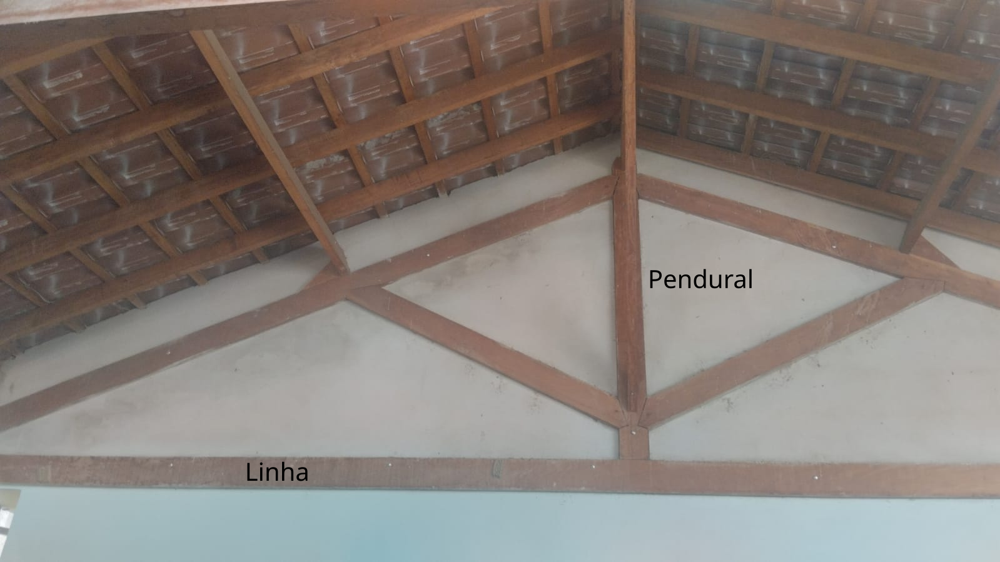
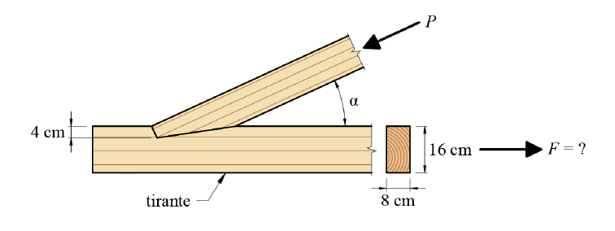
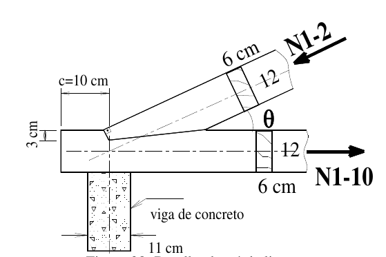
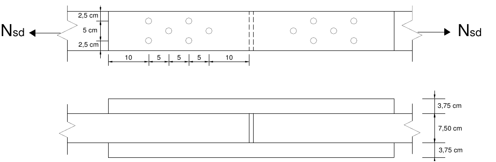

3 - Peças Tracionadas
=======================

Elementos estruturais, barras, tracionados aparecem em treliças, contraventamento e em tirantes.
Na tesoura abaixo, a **linha** e o **pendural** são **elementos tipicamente tracionados**'.

.. admonition:: NBR 7190-1:2023

   - Tração paralela às fibras;
   -  Comportamento elasto-frágil até à ruptura, sem a ocorrência de valores significativos de deformações antes do rompimento;
   -  Tração paralela às fibras ocorre principalmente nas treliças e nos tirantes de madeira;
   -  Quando as tensões de **tração perpendicular às fibras** puderem atingir valores significativos, devem ser utilizados dispositivos que impeçam a ruptura decorrente dessas tensões.

3.1 - Condição de segurança
~~~~~~~~~~~~~~~~~~~~~~~~~~~

.. math::

   \sigma_{N_{t,d}} = \frac{N_{t,d}}{A} \leq f_{t,0,d}
   
- :math:`\sigma_{N_{t,d}}` é a tensão de tração solicitante de cálculo    

- :math:`N_{t,d}` é a força de tração paralela às fibras;

- :math:`A` é a **área líquida** da secão tranversal; 

3.2 - Exercícios
~~~~~~~~~~~~~~~~

a. Qual o máximo valor valor da força :math:`F` de tração para a linha da tesuora (:math:`16cm \times 8cm`) representada abaixo:

(`Ramon Vileta, et all 2020 <https://www.fec.unicamp.br/~nilson/apostilas/apostila_exer_est_mad-rev1.pdf>`_. Acesso em abril/2025)

Dados:

- Madeira C30;
- Carregamento de longa duração;
- Classe 1 de umidade. 

b. O detalhe da figura representa a ligação entre o banzo superior e inferior, chamada ligação de extremidade, para uma treliça de madeira classe D60. 
Os esforços normais de cálculo nas peças estão identificados a seguir. 
Pede-se a verificação do estado limite último para a barra tracionada da ligação de extremidade. 
Considerar carregamento de longa duração e classe de umidade 2.

Esforços Barra 1-10: 

- :math:`N_{gk} = + 23.86 N` (carga permanente); 

- :math:`N_{qk} = + 12.35 N` (vento);

:math:`\theta = 23^o`.

(`Ângela do Vale, et all 2012 <https://giem.ufsc.br/files/2017/02/Apostila-Estrutura-de-Madeira.pdf>`_. Acesso em abril/2025).

c. A linha de uma tesoura está submetida ao esforço solicitante de cálculo :math:`N_{sd} = 50kN`. 
Considerando uma situação duradoura de projeto, verifique se a seção :math:`7,5 cm \times 10cm` atende a este esforço.

   
   
Dados:

- Conífera classe C-30; 
- carregamento de longa duração; 
- classe 4 de umidade;
- diâmetro dos furos :math:`13,5 mm`.

(`Ângela do Vale, et all 2012 <https://giem.ufsc.br/files/2017/02/Apostila-Estrutura-de-Madeira.pdf>`_. Acesso em abril/2025).
